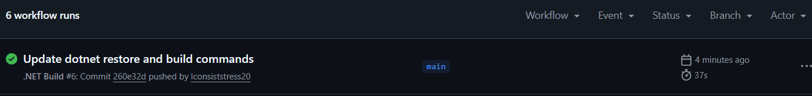

# Cybersecurity Awareness Chatbot

##  Student Name

[Casey Malungane]

##  Project Description

This project is a C# console-based chatbot that helps users learn about cybersecurity. The chatbot interacts with the user and provides advice on how to stay safe online.

##  Features

* User name input and greeting
* ASCII art interface
* Audio greeting using a WAV file
* Input validation
* Chatbot responses based on keywords
* Help command to display topics

##  How It Works

When the program starts, it displays a welcome message and plays an audio greeting. The user enters their name and can then interact with the chatbot.

The chatbot responds to user input based on keywords. If the user types **"help"**, a list of available topics is shown.

The program runs continuously until the user types **"exit"**.

##  Topics Covered

* Password safety
* Phishing awareness
* Safe browsing
* Ransomware

##  Challenges Faced

One challenge was implementing the audio feature. The SoundPlayer class only supports PCM WAV files, so the audio file had to be converted to the correct format.

## How to Run the Program

1. Open the project in Visual Studio
2. Build the solution
3. Run the program
4. Enter your name
5. Type **help** to see available topics

##  Example Commands

* help
* password
* phishing
* safe browsing
* exit

##  Files Included

* Program.cs
* welcome.wav

##  Conclusion

This project demonstrates basic chatbot functionality using C#. It helped improve my understanding of user input handling, validation, and simple program logic.

##  CI Workflow Result

